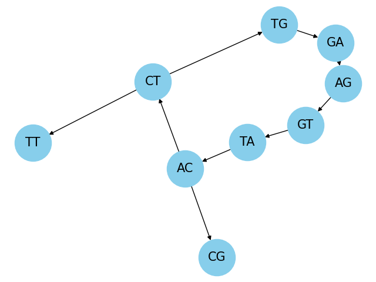
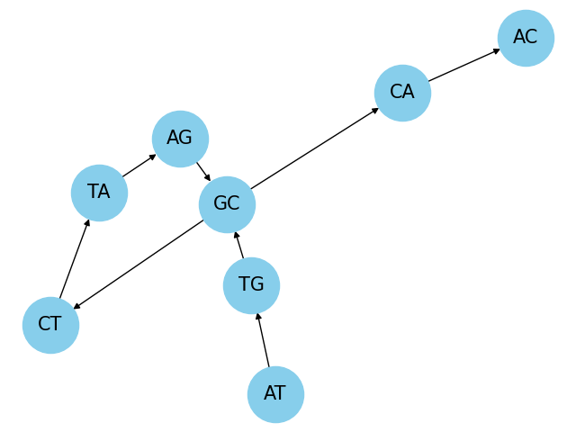

# Bioinformatics Algorithms

This project implements various bioinformatics algorithms for DNA sequence assembly and analysis using C++, Python, and Bash scripts.

## Table of Contents

- [Introduction](#introduction)
- [Installation](#installation)
- [Usage](#usage)
- [Algorithms](#algorithms)
- [File Structure](#file-structure)
- [Results](#results)
- [Contributing](#contributing)
- [License](#license)

## Introduction

The Bioinformatics Algorithms project aims to provide efficient implementations of key algorithms used in DNA sequence assembly and analysis. The main focus of this project is on the construction and traversal of De Bruijn graphs for assembling DNA reads into contiguous sequences.

## Installation

To build and run the project, follow these steps:

1. Clone the repository:
   ```
   git clone https://github.com/your-username/bioinformatics-algorithms.git
   ```

2. Navigate to the project directory:
   ```
   cd bioinformatics-algorithms
   ```

3. Create a build directory and navigate to it:
   ```
   mkdir build && cd build
   ```

4. Generate the build files using CMake:
   ```
   cmake ..
   ```

5. Build the project:
   ```
   make
   ```

## Usage
Since this project is aimed at researching a simple implementation of Fleury's algorithm, there are 4 experiments configured: readsPerfectEulerian, readsNonEulerian, readsEulerianWithDeadEnds and laboratory. This experiments are aimed at testing the algorithm with simple but confusing De Brujin graph structures. You may run these experiments as:
```
build/main testFleury <experimentName>
```
If you want to generate a visualization for the graph, you must replace the variable TESTTYPE in workflow_scripts/graphVisualization.sh with the experiment you want to generate the graph for. After replacing it, you may execute the pipeline as:
```
workflow_scripts/graphVisualization.sh
```
For FASTQ k-mer frequency, you may save your FASTQ file in the folder fastq_files, replace the path string in the FASTQ_FILE variable for the kmerFreq.sh workflow script and call the pipeline as:
```
workflow_scripts/kmerFreq.sh
```
This will generate an image in images/, if you dont want this, you may also run:
```
build/main kmerfreq <fastqPath>
```

## Algorithms

The project implements the following algorithms:

1. **De Bruijn Graph Construction**: Constructs a De Bruijn graph from DNA reads using k-mers.
2. **Eulerian Path Finding**: Finds an Eulerian path in the De Bruijn graph using Fleury's algorithm.
3. **K-mer Frequency Calculation**: Calculates the frequency of k-mers in the DNA reads.

## File Structure

The project has the following file structure:

- `Assembly/De_Brujin_Graphs`: Contains the implementation of the De Bruijn graph construction and traversal algorithms.
  - `include/graph.h`: Header file for the graph-related functions and data structures.
  - `src/graph.cpp`: Source file for the graph-related functions and data structures.
  - `visualize_graph.py`: Python script for visualizing the De Bruijn graph.
  - `visualize_kmerFrequency.py`: Python script for visualizing the k-mer frequency distribution.
- `external/kseqpp`: External library for parsing FASTQ files.
- `fastq_files`: Directory containing the input FASTQ files.
- `images`: Directory containing the generated visualizations.
- `main.cpp`: Main source file for the project.
- `workflow_scripts`: Directory containing Bash scripts for automating the workflow.

```
bioinformatics-algorithms
├─ Assembly
│  └─ De_Brujin_Graphs
│     ├─ include
│     │  └─ graph.h
│     ├─ src
│     │  └─ graph.cpp
│     ├─ visualize_graph.py
│     └─ visualize_kmerFrequency.py
├─ CMakeLists.txt
├─ LICENSE
├─ README.md
├─ external
│  └─ kseqpp
├─ fastq_files
│  ├─ ERR103404_1.fastq.gz
│  └─ ERR103404_2.fastq.gz
├─ images
│  ├─ graphEulerianExtras.png
│  ├─ graphExp3.png
│  ├─ graphNonEulerian.png
│  ├─ graphPerfectEulerian.png
│  └─ topLeastkmerFreq.png
├─ main.cpp
└─ workflow_scripts
   ├─ graphVisualization.sh
   ├─ kmerFreq.sh
   └─ temp_output.txt

```

## Results

<div style="display: flex; justify-content: center;">
  
  
</div>

Left:
```
Test: Eulerian Cycle with Extras
Graph structure:
Node GA has edges to: AG 
Node TG has edges to: GA 
Node CG has edges to: 
Node CT has edges to: TG TT 
Node TT has edges to: 
Node AC has edges to: CT CG 
Node TA has edges to: AC 
Node GT has edges to: TA 
Node AG has edges to: GT 
Eulerian Circuit: AG -> GT -> TA -> AC -> CT -> TG -> GA -> AG -> END
```
Right:
```
Test: Assembly Lab Reads
Graph structure:
Node CA has edges to: AC 
Node AG has edges to: GC 
Node AC has edges to: 
Node TA has edges to: AG 
Node CT has edges to: TA 
Node GC has edges to: CT CA 
Node TG has edges to: GC 
Node AT has edges to: TG 
Eulerian Circuit: AT -> TG -> GC -> CT -> TA -> AG -> GC -> CA -> AC -> END
```


## Contributing

Contributions to the Bioinformatics Algorithms project are welcome! If you find any issues or have suggestions for improvements, please open an issue or submit a pull request.

You may also contact me via [LinkedIn](https://www.linkedin.com/in/mario-pascual-gonzalez/).

## License

This project is licensed under the [MIT License](LICENSE).
